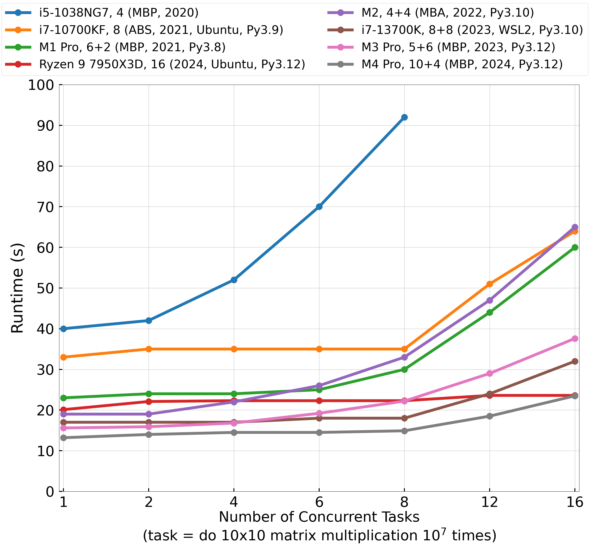

# Introduction
This is a simple and naive performance testing tool, derived from my workflow that heavily uses Python3 and Numpy. The testing is not comprehensive, but I think it is a good enough estimation.

# Test CPU Performance
Stress all kinds of CPU mainly by small matrix multiplication (I observe that small matrix multipliaction in Numpy only uses single core, while large matrix multiplication uses multi-core). Just run the following in the terminal:

**python3 stress.py -t 1 2 4 6 8 12 16**

# Results

**Evaluation**
1. M1 Pro is a laptop CPU (red line), but it beats the high-end desktop Intel CPU (green line), not to mention the labtop 10th-gen Intel CPU (blue and orange line). Note that the laptop i7 (blue line) is slower than laptop i5 (orange line). I think it is because the Microsoft Surface easily overheats and the Windows operating system will decrease the frequency, LOL.
2. M2 in MacBook Air (purple line) is faster than M1 Pro (red line) when the number of task is 4 or under, but is slower when the number of task is larger than 4. This is because the M1 Pro has 6 performance cores and 2 efficiency cores while the M2 has 4 performance cores and 4 efficiency cores.

# Notes
When evaluating Python on Apple Sillicon, need to be careful that your Anaconda might be running on Rosetta (increase runtime nearly by a factor of 2). Prior April 2022, the Anaconda only has intel version. To circumvent Rosetta, need to use the MacOS's built-in Python3. After May 2022, Anaconda released the M1 chip version and it is as fast the MacOS's built-in Python3.
